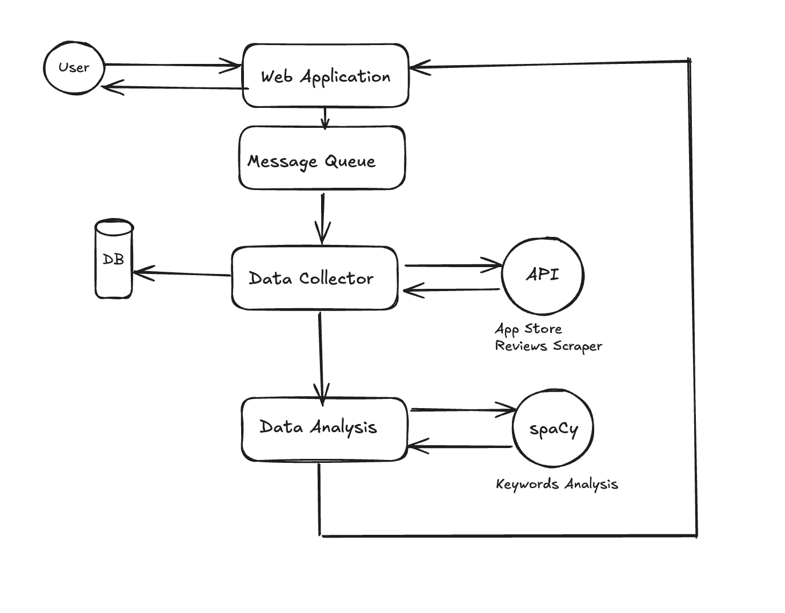

<h1>Final Project</h1>
<h2>Project description</h2>
The goal of this app is to conduct keyword analysis of App store app reviews. 
This app is made for UX designers to facilitate qualitative user research. 
The problem this app is solving entails the Agile prioritization of future design sprints, 
specifically it highlights the pain points of users that should be addressed first in the next design sprint. 
This product is unique because it’s open source. 
Also, there is a lack of applications that automate qualitative research for ux designers instead of doing it manually.

<h2>Website</h2>

https://sillybilly777.pythonanywhere.com

<h2>GitHub Repo</h2>

https://github.com/zettlingzettel/UX-Reviews-AppStore

<h2>Project structure</h2>
This project is set up as a monorepo.

`/src` directory contains `app.py` & tests.

`/.github` contains the configuration file for running the tests in GitHub Actions.

`/grafana` folder contains grafana related files.

`/prometheus` folder contains prometheus related files.

`/venv` contains virtual environment.

`wsgi` file in the root directory is needed for continous deployment.

`requirements.txt` is needed to download the required packages for the project.

`docker-compose.yaml` in the root directory & `Dockerfile` in the `/src` directory are needed to run the docker.

<h2>Instructions for running the application:</h2>
Deactivate .venv if it is running with
```deactivate```

Activate venv with
```source venv/bin/activate```

Export the app with
```export FLASK_APP=src/app.py```

Run the app with
```flask run```

The server is running locally on http://127.0.0.1:5000

App id includes only digits (without letters or spaces)


Please access the following endpoints after submitting the form:
* Application health endpoint: http://127.0.0.1:5000/health

* Application metrics endpoint: http://127.0.0.1:5000/metrics_data

* Application Database Results endpoint: http://127.0.0.1:5000/database_data

To run unit tests go to the `/src/tests` folder and run
```python -m test_all_unit_tests```

In the unit tests you can see: 

`<frozen importlib._bootstrap>:1049: ImportWarning: _SixMetaPathImporter.find_spec() not found; falling back to find_module()
`

I found the article about this error here: https://blog.pecar.me/six-warnings

It means that this error should not affect the tests, because they are still able to run.

To run integration tests go to the `/src/tests` folder and run
```python -m test_all_integration_tests```

Automatic testing is implemented on github

To run grafana & prometheus

```open -a docker```

```docker-compose up -d```

To open prometheus:
http://localhost:9090/

To show metrics inside prometheus:
```Status -> Targets -> Endpoint http://localhost:9090/metrics```

To open grafana
http://localhost:3000/

The login & the password for grafana is:

login: admin

password: admin

After opening grafana navigate to dashboards.
Next click on `add visualization`.
Select data source `prometheus-2`

If there is no `prometheus-2` data source, navigate to:

`home`

`add you first data source`

To add the source to grafana: 
```http://host.docker.internal:9090```

To stop containers:
```docker stop grafana```
```docker stop my_flask_app-node-exporter-1```
```docker stop my_flask_app-flask-app-1```
```docker stop my_flask_app-prometheus-1```

Only the grafana & the prometheus need the dockerfile in order to run.

<h2>Whiteboard Architecture:</h2>



1. User sends the post request from the HTML front-end using the form.

2. After that this post requests goes into the rabbitmq queue to distribute the load on the system. 

3. Next, the post request reaches the data collector.

4. It sends the query to the API that shows AppStore Reviews. 

6. Then, the data get saved into the database.

7. This data is getting saved into the database.

8. After that the data from the data collector get sent to the spaCy, 
where keyword analysis is conducted. 

9. The reviews from AppStore & the keywords received during the data analysis 
get displayed in the front end.

<h2>Project requirements </h2>

| Web application basic form, reporting | ✅                                        | HTML, PythonAnywhere |
| ------------------------------------------- | - | ---------------------------------------- |
| Data collection                                                          | ✅  | Python, SQLite                                                                   |
| Data analyzer                                                            | ✅  | NLP spaCy                                                                        |
| Unit tests                                                               | ✅  | Connection, analysis, database tests                                             |
| Data persistence any data store                                          | ✅  | SQLite                                                                           |
| Rest collaboration internal or API endpoint                              | ✅  | itunes.apple.com API                                                             |
| Product environment                                                      | ✅  | PythonAnywhere via Continuous Deployment                                         |
| Integration tests                                                        | ✅  | Health, metrics & database tests                                                 |
| Using mock objects or any test doubles                                   | ✅  | Used in the tests                                                                |
| Continuous integration                                                   | ✅  | GitHub Hook & GitHub tests                                                       |
| Production monitoring instrumenting                                      | ✅  | Docker, Prometheus & Grafana                                                     |
| Event collaboration messaging                                            | ✅  | Pika                                                                             |
| Continuous delivery                                                      | ✅  | GitHub Actions & Python Anywhere                                                 |


<h2>Data Collector - SQLite3 Cursor</h2>
<b><u>Why?</u></b>

Can be used for:
- Retrieval of data
- Addition of data
- Removal of data
- Querying data


<h2>Data Analyser spaCy</h2>
<b><u>Why?</u></b>
- Fast
- Has pre-trained models
- Easy to use
- Deployment friendly
- Active updates

<h2>Unit Tests</h2>

<b><u>Why?</u></b>

Unit tests can help:
- Facilitate refactoring
- Reduce debugging tme
- Ensure code quality of the individual parts of the app
- Simplify integration testing

<h2>Database</h2>
The application uses SQLite as a database.

<b><u>Why Relational Database?</u></b>

- Used for structured data
- Can be backed up and restored easily
- Allows to query database in different ways
- Supports ACID properties (atomicity, consistency, isolation, durability)

<b><u>Why SQLite?</u></b>
- Suitable for small-sized data 
- Lightweight
- Easy to set up
- No need to set up a database server
- Fast

<h2>API endpoint</h2>
This app uses iTunes API to get the data.
It is one of the two legal ways to scrape AppStore Reviews with minimal requirements to set up API.


<h2>Product Environment</h2>

This app uses PythonAnywhere as Product Environment.

<b><u>Why?</u></b>
- A ready-to-use python environment with a minimal setup
- Can be accessed from any platform
- Provides integrated tools, eg console
- No hardware dependency


<h2>Integration Tests</h2>

<b><u>Why?</u></b>

Integration tests can:
- Verify interactions
- Catch integration issues
- Improve reliability
- Simulate real-world scenarios
- Test the system as a whole

<h2>Using mock objects or any test doubles</h2>

<b><u>Why?</u></b>
- Fast
- Can cover edge cases
- Can be used in parallel testing
- Updating mocks can be easier than updating the real objects
- Can isolate the dependencies

<h2>Continuous Integration</h2>
Continuous integration checks are run using GitHub Actions.
The following check that includes unit & integration tests currently exists:

Tests: `./github/workflows/tests.yml`

<b><u>Why?</u></b>
- Automated testing
- Immediate feedback
- Integration with the GitHub ecosystem
- Scalability

<h2>Production monitoring instrumenting</h2> 
This applications uses prometheus & grafana for monitoring.

<b><u>Why production monitoring?</u></b>
- Early detection of issues
- Reduced downtime
- Resource utilization tracking
- Fault tolerance
- Predictive analytics by using historical data
- Regulatory compliance with system availability


<b><u>Why Prometheus:</u></b>
- Scrapes data at specified intervals
- Includes Alertmanager to handle alerts based on metrics thresholds
- Integration with Grafana

<b><u>Why Grafana:</u></b>
- Rich Visualisations
- Integration with Prometheus
- Customizable dashboards

<h2>Event collaboration messaging</h2> 
Event collaboration messaging allows to send messages in a reliable, scalable & flexible manner.
Helps to facilitate communication between different parts of a system.

<b><u>Why?</u></b>
- Asynchronous communication
- Reliability
- Message queuing
- Flexible routing

<h2>Continuous Delivery</h2>
The application gets automatically deployed to PythonAnywhere after each commit pushed to the `main` branch.
It is being deployed with the help of the hook in the `app.py` & additional setup in PythonAnywhere.

<b><u>Why?</u></b>
- Automation of workflows
- Instant feedback
- Efficient rollbacks
